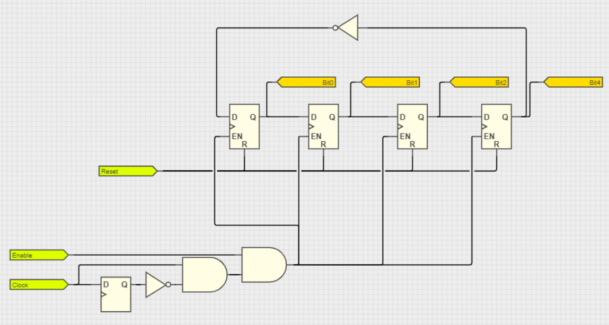
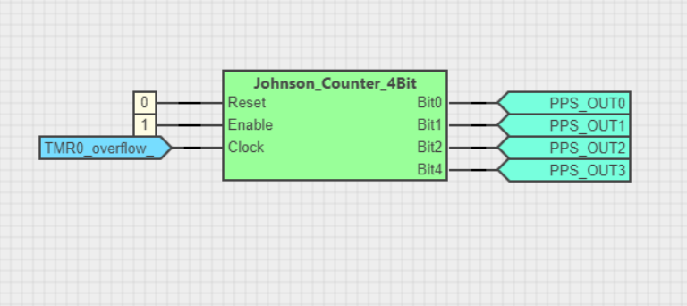
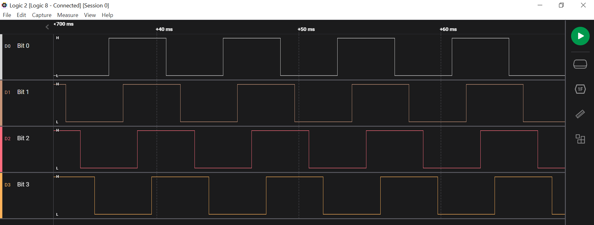

<!-- Please do not change this html logo with link -->

# Johnson Counter 4Bit

The module has Reset, Enable and Clock inputs. 

The counter clock can be configured by the user and is not dependent on CLB Clock Selection. The clock signal can be generated for example by using a timer overflow or the CLB clock.

| **Reset** | **Enable** | **Output** |
|:---------:|:----------:|:----------:|
|     0     |      0     |  Disabled  |
|     0     |      1     |   Enabled  |
|     1     |      0     |    Reset   |
|     1     |      1     |    Reset   |

The schematic is shown in the below image. A positive edge detector is used for the Clock input.
 

## Demo

The demo shows an exemple of using the counter. TMR0_Overflow is used as a Clock input.
 

 The waveforms obtained on each output pin are shown in the below image.
 