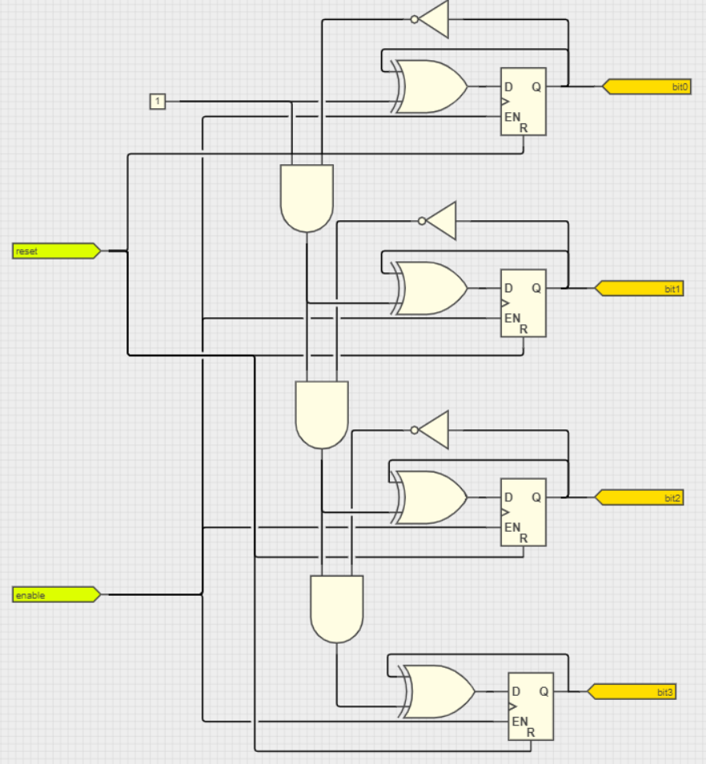
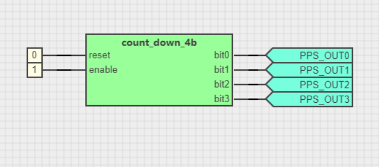
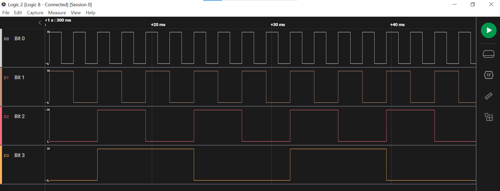

<!-- Please do not change this html logo with link -->

# 4-Bit Binary Down Counter

The module has Reset and Enable inputs. 

| **reset** | **enable** | **output** |
|:---------:|:----------:|:----------:|
|     0     |      0     |  Disabled  |
|     0     |      1     |   Enabled  |
|     1     |      0     |    Reset   |
|     1     |      1     |    Reset   |

The schematic is shown in the below image.
 

## Demo

The demo shows an example of using the counter.
 

 The waveforms obtained on each output pin are shown in the below image.
 