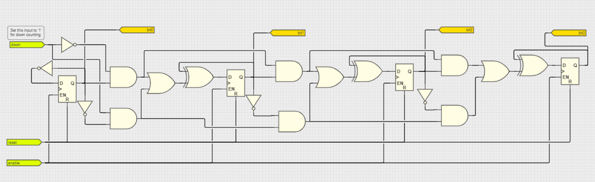
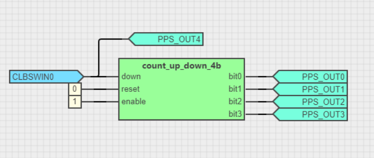
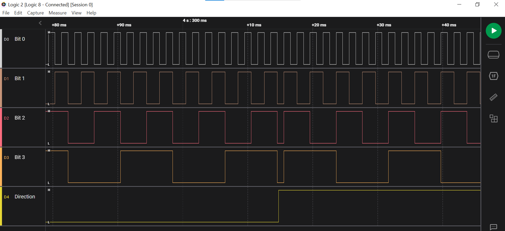

<!-- Please do not change this html logo with link -->

# 4-Bit Up/Down Counter

The module has Reset and Enable inputs. The direction of the counter can be changed by using the Down input.

| **reset** | **enable** |    **down**   |   **output**  |
|:---------:|:----------:|:-------------:|:-------------:|
|     0     |      0     |       0       |    Disabled   |
|     0     |      0     |       1       |    Disabled   |
|     0     |      1     |       0       |  Up Counting  |
|     0     |      1     |       1       | Down Counting |
|     1     |      x     |       x       |     Reset     |

The schematic is shown in the below image.
 

## Demo

The demo shows an example of using the counter. The direction is changed by using a CLB Software Input Register (CLBSWIN).
 

 The waveforms obtained on each output pin are shown in the below image.
 